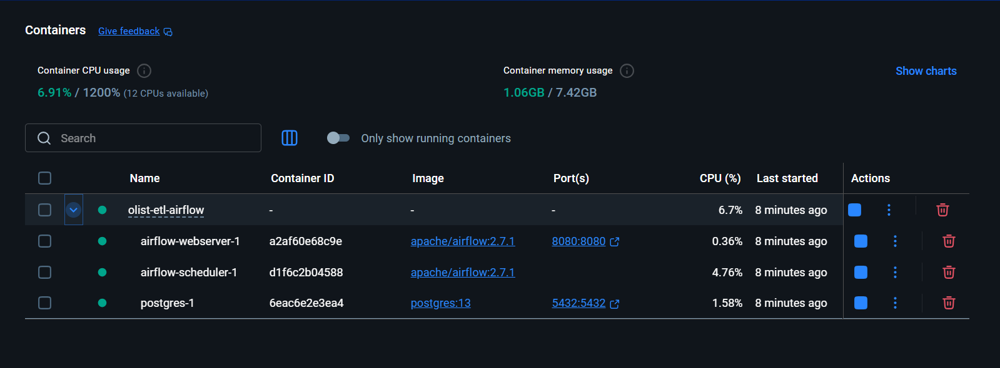
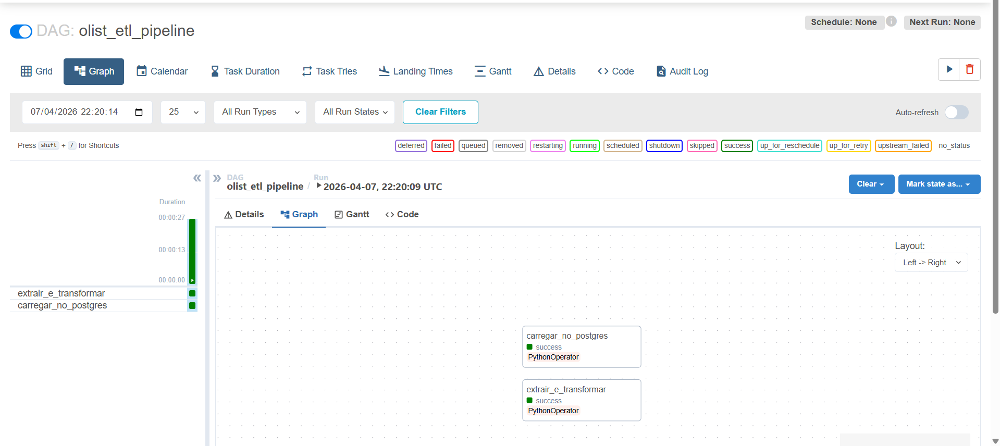
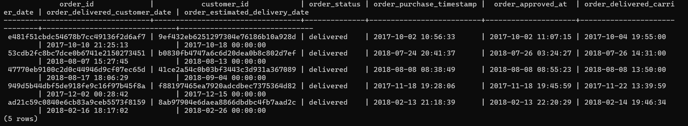

# Olist ETL Pipeline com Apache Airflow

Pipeline de ETL dos dados públicos do Olist, orquestrado com Apache Airflow e armazenado em PostgreSQL, com toda a infraestrutura containerizada via Docker.


---

## Arquitetura

```
olist_orders_dataset.csv
        ↓
[ extrair_e_transformar ]   → lê e transforma o CSV
        ↓
[ carregar_no_postgres ]    → insere os dados no banco
        ↓
  PostgreSQL (olist_orders)
```

---

## Pré-requisitos

Antes de começar, instale:

- [Docker Desktop](https://www.docker.com/products/docker-desktop) — certifique-se de que está **aberto e rodando** (ícone da baleia 🐳 na barra de tarefas) antes de executar qualquer comando
- [Git](https://git-scm.com/)
- Dados do Olist disponíveis no [Kaggle](https://www.kaggle.com/datasets/olistbr/brazilian-ecommerce) — faça o download antes de prosseguir

---

## Demonstração

### Containers rodando



### Pipeline executado com sucesso



### Dados carregados no PostgreSQL




## Como executar

### Passo 1 — Clonar o repositório

Abra o terminal (CMD ou PowerShell no Windows) e execute:

```bash
git clone https://github.com/JoaoVTozoni/olist-etl-airflow.git
cd olist-etl-airflow
```

---

### Passo 2 — Adicionar os dados

Os dados **não estão incluídos no repositório** e precisam ser baixados separadamente. Acesse o [Kaggle](https://www.kaggle.com/datasets/olistbr/brazilian-ecommerce), faça o download e extraia o arquivo `olist_orders_dataset.csv`.

Em seguida, cole o arquivo dentro da pasta `dataset_projeto_DE1`, que já existe na raiz do projeto após o clone:

```
olist-etl-airflow/
└── dataset_projeto_DE1/
    └── olist_orders_dataset.csv   ← coloque aqui
```

> ⚠️ Se a pasta `dataset_projeto_DE1` não existir, crie-a manualmente. Não use o nome `datasets` — o projeto não vai reconhecer.

---

### Passo 3 — Subir os containers

```bash
docker compose up -d
```

Esse comando pode demorar alguns minutos na primeira vez. Para confirmar que tudo subiu corretamente:

```bash
docker compose ps
```

Todos os serviços devem aparecer com status `running`.

---

### Passo 4 — Inicializar o Airflow *(apenas na primeira vez)*

```bash
docker compose run --rm airflow-webserver airflow db init
```

**Windows (CMD/PowerShell):**

```bash
docker compose run --rm airflow-webserver airflow users create --username airflow --firstname Admin --lastname User --role Admin --email admin@example.com --password airflow
```

**Linux/Mac:**
```bash
docker compose run --rm airflow-webserver airflow users create \
  --username airflow \
  --firstname Admin \
  --lastname User \
  --role Admin \
  --email admin@example.com \
  --password airflow
```

### Passo 5 — Acessar o painel e executar

Acesse **http://localhost:8080** com as credenciais:

- Usuário: `airflow`
- Senha: `airflow`

Localize a DAG `olist_etl_pipeline`, ative-a pelo botão de toggle e clique em ▶️ para iniciar a execução manual.

---

### Passo 6 — Verificar os resultados

Quando as tasks `extrair_e_transformar` e `carregar_no_postgres` aparecerem em verde, o pipeline foi concluído com sucesso.

Para validar os dados inseridos no banco, execute no terminal:

```bash
docker exec -it olist-etl-airflow-postgres-1 psql -U airflow -c "SELECT * FROM olist_orders LIMIT 5;"
```

> ⚠️ O nome do container pode variar conforme o nome da pasta onde o projeto foi clonado. Se o comando falhar, rode `docker ps` para ver o nome correto do container do Postgres.

---


